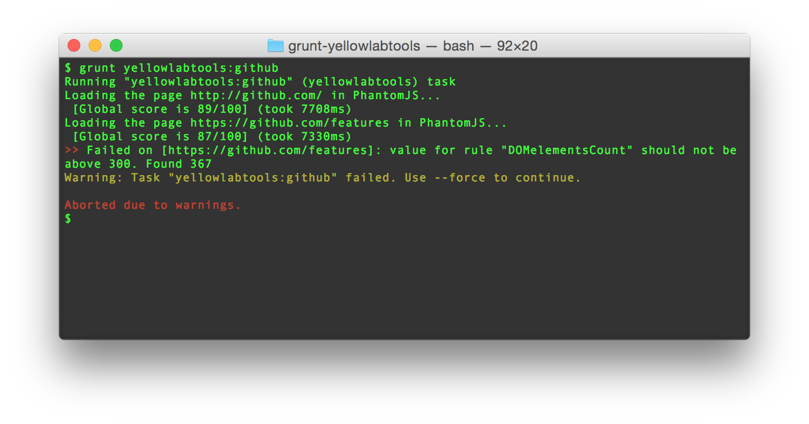

# grunt-yellowlabtools

> Grunt plugin for YellowLabTools.

[YellowLabTools](http://yellowlab.tools) is an audit tool that loads a page in PhantomJS and detects front-end **bad practices** and **performance issues**.

Using audit tools is great, but you're going to use it once or twice, then forget about it! This Grunt plugin helps you add a **performance checking** step to your workflow.

1. Configure it once
2. Add it to your delivery process
3. Forget about it...
4. ...until the day something goes wrong and the task fails

Unlike most of the similar tools ([grunt-pagespeed](https://github.com/jrcryer/grunt-pagespeed), [grunt-perfbudget](https://github.com/tkadlec/grunt-perfbudget), grunt-pagespeedio)

I recommend using this grunt-task if:
 - you're a developper and you're optimizing your code
 - you're a devOps and you want to block a release while the staging website is not perfect
 - you're a team and you're practicing continous integration


## Getting Started
This plugin requires Grunt `~0.4.5`

If you haven't used [Grunt](http://gruntjs.com/) before, be sure to check out the [Getting Started](http://gruntjs.com/getting-started) guide, as it explains how to create a [Gruntfile](http://gruntjs.com/sample-gruntfile) as well as install and use Grunt plugins. Once you're familiar with that process, you may install this plugin with this command:

```shell
npm install grunt-yellowlabtools --save-dev
```

Once the plugin has been installed, it may be enabled inside your Gruntfile with this line of JavaScript:

```js
grunt.loadNpmTasks('grunt-yellowlabtools');
```

## The "yellowlabtools" task

### Overview
In your project's Gruntfile, add a section named `yellowlabtools` to the data object passed into `grunt.initConfig()`.

```js
grunt.initConfig({
  yellowlabtools: {
    production: {
      urls: [
        'https://github.com/',
        'https://github.com/features'
      ],
      failConditions: [
        // The global score is the one calculated by Yellow Lab Tools
        'fail if at least one url has a global score < 80/100',

        // Every single rule has its own score
        'fail if at least one url has a rule score < 50/100',

        // You can be more demanding on a scpecific rule
        'fail if at least one url has a domElementsCount score < 100/100',

        // Or you can decide to be cooler on a specific rule
        'fail if at least one url has a domMaxDepth score < 20/100',
        
        // ... coolest
        'ignore iframesCount',

        // For each rule, you can check directly the metric instead of the score by omitting '/100'
        'fail if at least one url has a domElementsCount > 2000'
      ]
    }
  },
});
```


### Options

Coming soon


### Usage Examples

#### Define a threshold on Yellow Lab Tools' global score


```js
grunt.initConfig({
  yellowlabtools: {
    production: {
      urls: [
        'http://mywebsite.com'
      ],
      failConditions: [
        'fail if at least one url has a global score < 80/100'
      ]
    }
  },
});
```

The words `if at least one url` are not very relevant if you only test one url, but don't forget them.


#### Define a threshold for every rule

```js
grunt.initConfig({
  yellowlabtools: {
    production: {
      urls: [
        'http://mywebsite.com'
      ],
      failConditions: [
        'fail if at least one url has a rule score < 40/100'
      ]
    }
  },
});
```

#### Ignore the threshold for some specific rules

```js
grunt.initConfig({
  yellowlabtools: {
    production: {
      urls: [
        'http://mywebsite.com'
      ],
      failConditions: [
        'fail if at least one url has a rule score < 40/100',
        'ignore iframesCount',
        'ignore globalVariables'
      ]
    }
  },
});
```

These two rules will never complain again. Please note that ignoring rules will have no effect on the global score.


#### Define a threshold for a single rule

```js
grunt.initConfig({
  yellowlabtools: {
    production: {
      urls: [
        'http://mywebsite.com'
      ],
      failConditions: [
        'fail if at least one url has a DOMelementMaxDepth score < 90/100'
      ]
    }
  },
});
```

See the list of rules in the next chapter.

If you define a threshold for every rule, adding a single rule condition has the power to override it. For example, you can assert check that every rule score is over 80 **except** DOMelementMaxDepth that can be as low as 12.


#### Define a threshold on a metric

```js
grunt.initConfig({
  yellowlabtools: {
    production: {
      urls: [
        'http://mywebsite.com'
      ],
      failConditions: [
        'fail if at least one url has a DOMelementsCount > 2000'
      ]
    }
  },
});
```

The only difference between a metric threshold and a score threshold is the `score` word before the `<` or `>` operator.

Defining a threshold on a metric overrides any score threshold you might have defined.


## Rules

Here is the list of rules you can threshold.

#### DOM complexity
* DOMelementsCount: total number of HTML element nodes
* DOMelementMaxDepth: maximum level on nesting of HTML element node
* iframesCount: number of iframe nodes
* DOMidDuplicated: number of duplicated IDs found in DOM

#### DOM manipulations
* DOMinserts: number of DOM nodes inserts
* DOMqueries: number of DOM queries by id, className, tagName or querySelector
* DOMqueriesWithoutResults: number of DOM queries that returned nothing
* DOMqueriesAvoidable: number of repeated uses of a duplicated query
* eventsBound: number of addEventListener calls

#### Bad JavaScript
* jsErrors: number of JavaScript errors
* documentWriteCalls: number of calls to document.write(ln)
* consoleMessages: number of calls to console.* functions
* globalVariables: number of JS globals variables

#### jQuery version
* jQueryVersion: version of jQuery framework (if loaded)
* jQueryVersionsLoaded: number of loaded jQuery "instances"

#### CSS syntax errors
* cssParsingErrors: number of CSS files that failed to be parse by analyze-css

#### CSS complexity
* cssRules: number of CSS rules
* cssComplexSelectors: number of selectors consisting in 4 or more expressions
* cssComplexSelectorsByAttribute: selectors with complex matching by attribute (e.g. `[class$="foo"]`)
* cssColors: number of unique colors used in CSS

#### Bad CSS
* cssImports: number of `@import` rules
* cssDuplicatedSelectors: number of CSS selectors defined more than once
* cssDuplicatedProperties: number of CSS property definitions duplicated within a selector
* cssEmptyRules: number of rules with no properties
* cssExpressions: number CSS expressions (e.g. `expression(document.body.clientWidth > 600 ? "600px" : "auto")`)
* cssImportants: number of properties with value forced by `!important`
* cssOldIEFixes: number of fixes for old versions of Internet Explorer
* cssOldPropertyPrefixes: number of no longer needed vendor prefix (e.g. `--moz-border-radius`)
* cssUniversalSelectors: number of selectors trying to match every element (e.g. `.foo > *`)
* cssRedundantBodySelectors: number of redundant body selectors (e.g. `body .foo`)
* cssRedundantChildNodesSelectors: number of redundant child nodes selectors (e.g. `ul li`, `table tr`)

#### Requests number
* requests: total number of HTTP requests made
* htmlCount: number of HTML responses
* jsCount: number of JS responses
* cssCount: number of CSS responses
* imageCount: number of image responses
* webfontCount: number of web font responses
* videoCount: number of video responses
* jsonCount: number of JSON responses
* otherCount: number of other responses

#### Small requests
* smallJsFiles: number of JS assets smaller than 2 KB
* smallCssFiles: number of CSS assets smaller than 2 KB
* smallImages: images smaller than 2 KB

#### Network
* notFound: number of HTTP 404 responses
* closedConnections: number of requests not keeping the connection alive
* multipleRequests: number of static assets that are requested more than once
* cachingDisabled: responses with caching disabled
* cachingNotSpecified: responses with no caching header sent
* cachingTooShort: responses with too short caching time (less than a week)
* domains: number of domains used


## Results

Here is an example of a `yellowlabtools` grunt task failing. I hope it won't happen too often on your website:




## Author
Gaël Métais. I'm a webperf freelance based in Paris. If you understand french, you can visit [my website](http://www.gaelmetais.com).
